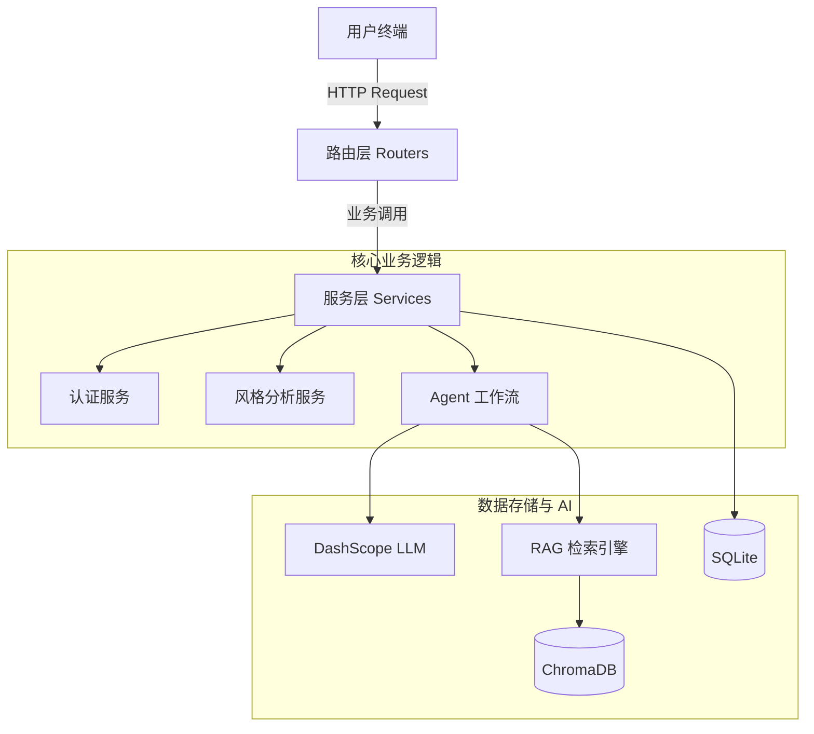
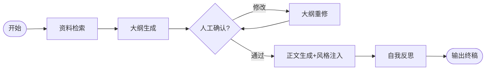

# 🕶️ 墨镜 (MoJing) - 智能写作分身系统

> **戴上墨镜，遇见另一个会写作的你。**  
> 一个基于 LangGraph 和 RAG 技术的智能写作助手，旨在通过风格迁移技术实现“去 AI 化”的个性化内容生成。

---

## 🚀 项目简介

墨镜不仅仅是一个写作工具，它是你的**智能写作分身**。通过深度学习用户的历史作品，它能精准克隆你的笔触与逻辑，让你在保持高效创作的同时，彻底告别千篇一律的“AI 味”。

### 核心特性
*   **🧬 笔迹克隆**: 异步分析用户范文，提取风格指纹并动态注入写作流程。
*   **📚 深度 RAG**: 基于 ChromaDB 构建私有知识库，为写作提供精准的事实依据。
*   **⚡ 多阶段 Agent**: 采用 LangGraph 编排“大纲-重修-正文-反思”链式工作流。
*   **🛡️ 安全隔离**: 实现用户级数据隔离，确保私有文档与写作历史的隐私安全。

---

## 🏗️ 总体架构设计

### 技术栈
*   **后端**: FastAPI, SQLAlchemy, Pydantic
*   **AI 编排**: LangGraph, DashScope (通义千问)
*   **数据库**: SQLite (关系型), ChromaDB (向量型)
*   **前端**: 原生 HTML/JS (沉浸式科技感 UI)

### 系统分层


---

## ⚙️ 核心工作流 (LangGraph)

墨镜采用三阶段独立工作流设计，确保长文本生成的逻辑连贯性：

1.  **大纲规划**: 结合 RAG 资料生成极简大纲（~100字）。
2.  **人工微调**: 支持用户对大纲进行反馈与重修。
3.  **风格注入与生成**: 动态检索风格指纹，生成正文并进行自我反思优化。



---

## 📡 API 接口文档

### 1. 认证模块 (`/auth`)
*   `POST /register`: 用户注册
*   `POST /login`: 获取 JWT Token

### 2. 智能写作 (`/write`)
*   `POST /outline`: 生成初稿大纲
*   `POST /refine`: 根据反馈重修大纲
*   `POST /generate`: 注入风格并生成正文

### 3. 风格管理 (`/style`)
*   `POST /upload`: 上传范文（后台异步分析）
*   `GET /list`: 获取风格样本列表
*   `DELETE /delete/{id}`: 删除风格样本

### 4. 知识库 (`/upload`)
*   `POST /upload`: 上传私有文档至向量库
*   `GET /list`: 查看已上传文档

---

## 💡 开发避坑与优化实录

在开发过程中，我们攻克了以下核心技术难题：

### 1. LLM 输出长度失控
*   **问题**: 模型无视提示词约束，持续输出超长内容。
*   **解决**: 采用“三重保障”策略——更换更听话的模型 (`qwen-turbo`) + 设置硬上限 (`max_tokens=200`) + 细化提示词指令。

### 2. 异步风格分析的稳定性
*   **问题**: 耗时任务阻塞主线程，导致接口响应慢。
*   **解决**: 利用 FastAPI `BackgroundTasks` 实现非阻塞式分析，并设计了兜底策略防止分析失败影响写作。

---

## 🛠️ 快速开始

1.  **安装依赖**:
    ```bash
    pip install -r requirements.txt
    ```
2.  **配置环境**:
    在项目根目录创建 `.env` 文件，填入你的 DashScope API Key。
3.  **启动服务**:
    ```bash
    python main.py
    ```
4.  **访问界面**:
    打开浏览器访问 `http://127.0.0.1:8000`

---

## 📝 总结

墨镜项目通过**分层架构**实现了高内聚低耦合，利用 **LangGraph** 解决了长文本生成的逻辑断层问题，并通过**异步风格迁移**技术实现了真正的个性化写作。该架构兼顾了系统的扩展性、安全性和用户体验。
